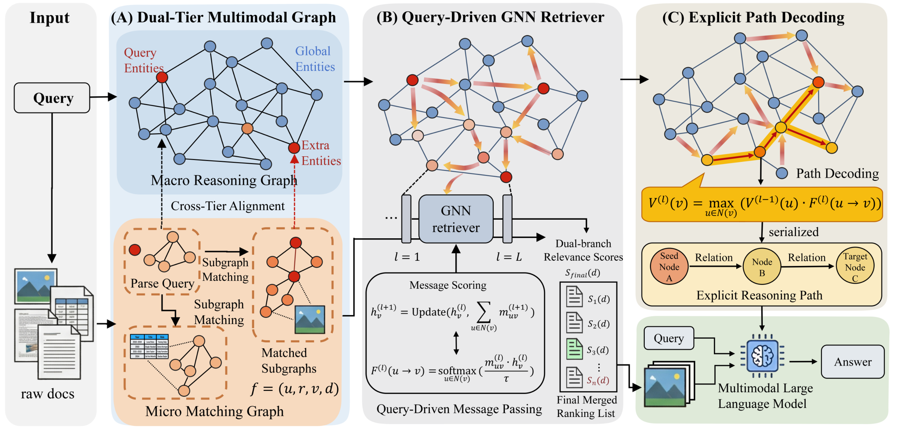

# DualG-MRAG

Official implementation of the ACM MM 2026 paper [**"DualG-MRAG: Decoupling
Macro-Reasoning and Micro-Matching for Multimodal Retrieval-Augmented
Generation"**](https://arxiv.org/abs/2607.28580) (MM '26, November 10–14, 2026, Rio de Janeiro, Brazil).



DualG-MRAG is a multimodal retrieval-augmented generation pipeline built around a
**dual-tier graph** over documents:

- **Macro Reasoning Graph** — document-level graph built from VLM image captions and
  OpenIE triples, plus equivalence edges between entities.
- **Micro Matching Graph** — fine-grained 4-tuple micro-facts (head, relation, tail,
  document pointer) extracted per document.
- **Cross-tier alignment** — exact and ColBERT-based links between macro entities and
  micro facts.
- **Dual-branch evidence activation** — SimGRAG-style branch-and-bound pattern
  matching combined with node-level document boosting.
- **Query-aware GNN retriever** — an NBFNet-style graph foundation model retriever
  (inherited from GFM-RAG) scores entities and documents over the dual-tier graph.
- **Reasoning-path decoding** — DP/Viterbi decoding over the L-hop DAG between
  retrieved documents produces an interpretable cross-document path, which is injected into the MLLM prompt.

Supported datasets: [MMQA](https://allenai.github.io/multimodalqa/), [WebQA](https://webqna.github.io/), and [ScienceQA](https://scienceqa.github.io/).

This repository is built on top of [GFM-RAG](https://github.com/RManLuo/gfm-rag) (Luo et al., NeurIPS 2025); see [Acknowledgements](#acknowledgements).

## Dependencies

- Python 3.12
- CUDA 12 and above

## Installation

```bash
conda create -n dualg-mrag python=3.12
conda activate dualg-mrag
conda install cuda-toolkit -c nvidia/label/cuda-12.4.1 # Replace with your desired CUDA version
git clone <this-repo-url>
cd DualG-MRAG
pip install poetry
poetry install
```

Stage 3 answer generation runs a local Qwen3-VL model through vLLM.

```bash
pip install "vllm>=0.10" qwen-vl-utils
```

Copy `.env.example` to `.env` and fill in your API keys (e.g. `OPENAI_API_KEY`)
if you use OpenAI-backed NER/OpenIE or answer generation.

## Data

The processed datasets and constructed graphs are released on
[Google Drive](https://drive.google.com/drive/folders/1MUpQJz2VZIQyKQMoznIKPwx69m4mjKNV?usp=sharing).

Raw directory layout expected by the pipeline (per dataset `data/<data_name>/`):

```text
data/<data_name>/
├── raw/
│   ├── dataset_corpus.json        # {doc_id: "title\nbody"}
│   ├── dataset_multimodal.json    # [{doc_id, title, text, images, tables}]
│   ├── train.json                 # (optional)
│   └── test.json
├── pictures/                      # image files referenced by basename
├── tables/                        # rendered table images (MMQA)
└── processed/                     # pipeline output
```

To rebuild the raw files from the original dataset releases, see the preparation
scripts under `scripts/` and the per-dataset summary in
[docs/workflow/dataset_configs.md](docs/workflow/dataset_configs.md).
The question ids of the 1000-question evaluation subsets used in our experiments
(sampled from the official MMQA dev split and the WebQA validation split)
are listed in [assets/selected_questions/](assets/selected_questions/)
(`mmqa1000.txt`, `webqa1000.txt`).

## Pipeline

### Stage 1 — Index construction

Builds the macro/micro graphs, cross-tier index, and QA annotations:

```bash
python -m gfmrag.workflow.stage1_index_dataset dataset.root=data dataset.data_name=mmqa
```

Outputs under `data/<data_name>/processed/stage1/` include `kg.txt`, `document2entities.json`, `micro_kg.jsonl`, `cross_tier_index.json`, `entity2micro.json`, and processed `train.json`/`test.json`.
See [docs/workflow/mmkg_stage1_schema.md](docs/workflow/mmkg_stage1_schema.md) for the full artifact schema. Batch script: [scripts/stage1_data_index.sh](scripts/stage1_data_index.sh).

### Stage 2 — Retriever training (optional)

Our experiments use the off-the-shelf GFM-RAG retriever
([`rmanluo/GFM-RAG-8M`](https://huggingface.co/rmanluo/GFM-RAG-8M)), so this
stage is only needed if you want to train the retriever on your own corpus.

Unsupervised KG pre-training:

```bash
torchrun --nproc_per_node=4 -m gfmrag.workflow.stage2_kg_pretrain
```

Supervised QA fine-tuning:

```bash
torchrun --nproc_per_node=4 -m gfmrag.workflow.stage2_qa_finetune
```

Scripts: [scripts/stage2_pretrain.sh](scripts/stage2_pretrain.sh), [scripts/stage2_finetune.sh](scripts/stage2_finetune.sh).

### Stage 3 — Retrieval + answer generation

#### MMQA

```bash
torchrun --nproc_per_node=4 -m gfmrag.workflow.stage3_qa_inference \
    dataset.root=data dataset.data_name=mmqa_test \
    qa_prompt=mmqa qa_evaluator=em_f1 \
    graph_retriever.model_path=rmanluo/GFM-RAG-8M \
    pattern_activation.enable=true \
    path_relation.enable=true \
    test.retrieval_only=true \
    final_eval.enable=true final_eval.path_select=false \
    final_generation.visual_budget.enable=true
```

#### WebQA

```bash
torchrun --nproc_per_node=4 -m gfmrag.workflow.stage3_qa_inference \
    dataset.root=data dataset.data_name=webqa_test \
    qa_prompt=webqa qa_evaluator=rougel_bertscore \
    graph_retriever.model_path=rmanluo/GFM-RAG-8M \
    pattern_activation.enable=true \
    path_relation.enable=true \
    test.retrieval_only=true \
    final_eval.enable=true final_eval.path_select=true \
    final_generation.visual_budget.enable=true
```

See `gfmrag/workflow/config/stage3_qa_inference.yaml` and [docs/workflow/dataset_configs.md](docs/workflow/dataset_configs.md) for the full switch list.

#### ScienceQA

```bash
python -m gfmrag.workflow.stage3_qa_inference \
    dataset.root=data dataset.data_name=scienceqa qa_prompt=scienceqa \
    graph_retriever.model_path=rmanluo/GFM-RAG-8M \
    test.scienceqa_export_macro_only=true

python scripts/run_scienceqa_qwen3vl_eval.py evaluate \
    --macro-jsonl outputs/qa_inference/scienceqa/<date>/<time>/scienceqa_macro_scores.jsonl \
    --output-dir outputs/scienceqa_eval
```

## Repository layout

```text
gfmrag/                 # main package (forked from GFM-RAG, same package name)
  kg_construction/      # macro/micro graph construction, NER, OpenIE, entity linking
  query_pattern/        # SimGRAG query parser, micro-macro activator, context builder
  workflow/             # stage1/2/3 pipelines + hydra configs
scripts/                # data preparation, evaluation, and utility scripts
docs/                   
```

## Acknowledgements

DualG-MRAG builds on top of [GFM-RAG](https://github.com/RManLuo/gfm-rag) — the GFM
retriever, training loop, and pipeline scaffolding are inherited from it, and the
`gfmrag/ultra/` directory vendors [DeepGraphLearning/ULTRA](https://github.com/DeepGraphLearning/ULTRA)
as the base GNN. We also acknowledge:

- [OSU-NLP-Group/HippoRAG](https://github.com/OSU-NLP-Group/HippoRAG): inspiration for the KG construction process.
- [microsoft/graphrag](https://github.com/microsoft/graphrag): inspiration for the project design.
- [SimGRAG](https://github.com/YZ-Cai/SimGRAG): the query-graph pattern matching algorithm used for micro-fact matching.

## Citation

If you find this repository helpful, please consider citing:

```bibtex
@article{tao2026dualg,
  title={DualG-MRAG: Decoupling Macro-Reasoning and Micro-Matching for Multimodal Retrieval-Augmented Generation},
  author={Tao, Jiacheng and Sun, Qingyun and Yuan, Haonan and Zhang, Ziwei and Li, Jianxin},
  journal={arXiv preprint arXiv:2607.28580},
  year={2026}
}
```
